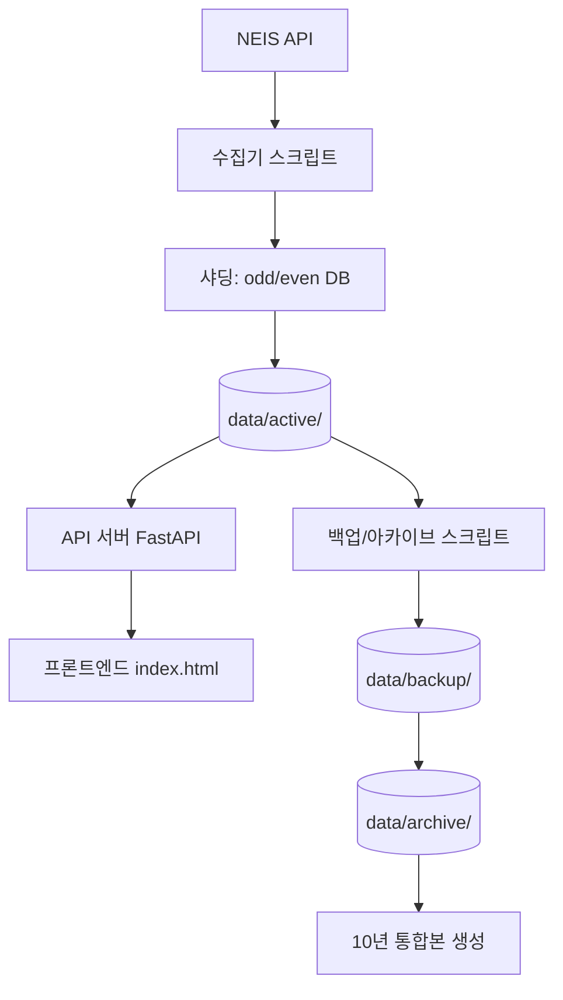

## 📘 **Hi-Dunkey NEIS 데이터 수집 및 제공 시스템**

### 프로젝트 개요
이 프로젝트는 NEIS(나이스) 교육청 API를 활용하여 **급식, 학사일정, 시간표, 학교 기본정보** 데이터를 자동으로 수집하고, 백업/아카이브하며, 웹 API를 통해 프론트엔드에 제공하는 통합 시스템입니다.  
학년도(3월~2월) 기준으로 데이터를 관리하며, 샤딩(sharding)과 캐싱(caching)을 통해 성능을 최적화하고, 자동 백업 정책으로 데이터 안정성을 확보합니다.

---

## 🚀 주요 기능

- **자동 데이터 수집**: NEIS Open API에서 급식, 학사일정, 시간표, 학교정보를 주기적으로 수집
- **샤딩(Sharding)**: 학교 코드 마지막 자리 기준 홀수/짝수로 DB를 분할하여 동시성 향상
- **학년도 기준 관리**: 3월~2월을 기준으로 데이터를 관리 (학년도 자동 계산)
- **단계별 캐시(L1~L4)**: 개인 즐겨찾기, Hot50, Warm 클러스터, Service Worker 캐시로 빠른 응답
- **백업 및 아카이브**: 2/20, 2/22, 4/15에 걸친 체계적인 백업/아카이브 정책
- **RESTful API**: FastAPI 기반의 API 서버로 프론트엔드에 데이터 제공
- **프론트엔드**: 학교 검색 및 FullCalendar 기반 학사일정 뷰어 (index.html)

---

## 🗂️ 시스템 아키텍처



### 디렉토리 구조
```
project/
├── scripts/                      # 실행 스크립트
│   ├── core/                     # 공통 모듈 (백업, DB, 로깅, 필터, ID 생성, 시간, 샤딩 등)
│   ├── parsers/                   # 도메인별 파서 (급식, 학사일정, 시간표, 학년)
│   ├── constants/                 # 상수 (API 키, 엔드포인트, 지역 코드, 학년 코드)
│   ├── collectors/                # 수집기 (meal, schedule, timetable, school_master)
│   ├── baskets/                    # 캐시 관리 (Hot50, Warm 클러스터)
│   ├── api_server.py               # FastAPI 서버
│   ├── run_daily.py                 # 매일 수집 (Hot50 위주)
│   ├── run_feb20.py                 # 2월 20일 전체 수집
│   ├── run_feb22.py                 # 2월 22일 백업/아카이브
│   └── run_april15.py               # 4월 15일 정리
├── data/                          # 데이터 저장소
│   ├── active/                     # 현재 학년도 데이터 (샤딩)
│   ├── backup/                      # 지난 3개 학년도 데이터
│   ├── archive/                     # 10년 블록 통합본
│   └── baskets/                     # Hot/Warm 캐시
│       └── warm/
├── logs/                           # 로그 파일
├── index.html                      # 프론트엔드
├── requirements.txt                # 의존성 패키지
└── README.md                       # 프로젝트 설명서
```

---

## 🛠️ 설치 방법

### 1. 저장소 클론
```bash
git clone https://github.com/your-username/hi-dunkey.git
cd hi-dunkey
```

### 2. Python 가상환경 생성 및 활성화 (선택)
```bash
python -m venv venv
source venv/bin/activate  # Linux/Mac
venv\Scripts\activate     # Windows
```

### 3. 의존성 설치
```bash
pip install -r requirements.txt
```

### 4. 환경 변수 설정
- **NEIS_API_KEY**: NEIS Open API 키를 환경 변수로 설정합니다.
  - 로컬 개발: `.env` 파일 생성 후 아래 내용 추가
    ```
    NEIS_API_KEY=your_actual_api_key
    ```
  - GitHub Actions: Repository Secrets에 `NEIS_API_KEY` 등록

### 5. 디렉토리 생성 (자동 생성되지만 확인)
```bash
mkdir -p data/active data/backup data/archive data/baskets/warm logs
```

---

## 🔧 설정 파일 (`scripts/constants/codes.py`)

주요 상수들이 정의되어 있습니다. 필요에 따라 수정하세요.

- `NEIS_API_KEY`: 환경 변수에서 로드
- `NEIS_ENDPOINTS`: API 엔드포인트
- `ALL_REGIONS`: 교육청 지역 코드
- `GRADE_CODES`: 학년 코드 매핑
- `BATCH_CONFIG`: 배치 크기 설정
- `API_CONFIG`: 네트워크 타임아웃, 재시도 설정
- `LIFECYCLE_DATE`: 백업/아카이브 기준일 (기본: 0222)

---

## 🏃 실행 방법

### 1. 수집기 실행 (매일)
```bash
# 전체 수집 스크립트 (Hot50 위주)
python scripts/run_daily.py
```

### 2. 2월 20일 전체 수집 (학년도 마감)
```bash
python scripts/run_feb20.py
```

### 3. 2월 22일 백업/아카이브
```bash
python scripts/run_feb22.py
```

### 4. 4월 15일 정리
```bash
python scripts/run_april15.py
```

### 5. API 서버 실행
```bash
# 개발 서버 (자동 리로드)
uvicorn scripts.api_server:app --reload --host 0.0.0.0 --port 8000

# 프로덕션 (워커 4개)
uvicorn scripts.api_server:app --host 0.0.0.0 --port 8000 --workers 4
# 또는 Gunicorn 사용
gunicorn scripts.api_server:app -w 4 -k uvicorn.workers.UvicornWorker --bind 0.0.0.0:8000
```

### 6. 프론트엔드 열기
`index.html` 파일을 웹 서버(예: Live Server)로 열어 학교 검색 및 학사일정을 확인합니다.

---

## 📅 백업 및 아카이브 정책

| 날짜 | 작업 | 설명 |
|------|------|------|
| **매일** | 일일 수집 | Hot50 학교 위주로 급식/학사일정 수집 (incremental) |
| **3,4,9,10월 월/수** | 시간표 수집 | 전체 학교 시간표 수집 |
| **매월 1,10,20일** | 전체 수집 | 급식/학사일정 전체 학교 수집 |
| **매월 1일** | 학교정보 수집 | 전체 학교 정보 수집 (변경분만) |
| **2월 20일** | 학년도 마감 | 모든 봇이 전체 학교 데이터를 수집 (full) + 날짜 백업 생성 |
| **2월 22일** | 연간 백업 | active DB → backup/ (VACUUM INTO) + 3년 초과 파일 archive 이동 + 통합본 갱신 |
| **4월 15일** | 정리 | backup → archive 이동, 1년 지난 파일 삭제, 4년 주기로 10년 통합본 생성 |

---

## 💾 캐시 시스템 (Baskets)

### L1: Personal Slot (브라우저)
- 개인 즐겨찾기 3개 학교 (localStorage)

### L2: Hot Basket (서버)
- `data/baskets/hot.json`에 저장
- 일간/월간/학기간/연간 가장 많이 검색된 50개 학교
- 매일 GA4 데이터로 갱신 (`scripts/baskets/update_hot.py`)

### L3: Warm Cluster
- `data/baskets/warm/`에 학교별 연관 검색어 저장
- 월 1회 GA4 로그 기반으로 생성 (`scripts/baskets/build_warm.py`)

### L4: Service Worker (브라우저)
- 최근 7일간 조회한 학교 캐싱 (별도 구현)

---

## 🌐 API 엔드포인트 (FastAPI)

| 엔드포인트 | 메서드 | 설명 | 파라미터 |
|-----------|--------|------|---------|
| `/api/schools` | GET | 학교 검색 | `query` (2자 이상) |
| `/api/schedule` | GET | 학사일정 조회 | `school_code`, `year` |
| `/api/meal` | GET | 급식 조회 | `school_code`, `date` (YYYYMMDD) |
| `/api/timetable` | GET | 시간표 조회 | `school_code`, `ay`, `semester`, `grade`, `class_nm` |

**예시 응답**
```json
// /api/schedule?school_code=7012345&year=2026
[
  {
    "title": "개교기념일",
    "start": "2026-05-15",
    "extendedProps": {
      "grade_disp": "",
      "sub_yn": 0,
      "dn_yn": 0,
      "ev_content": ""
    }
  }
]
```

---

## 🧪 테스트 방법

### 1. 수집기 단위 테스트
```bash
# 특정 지역만 수집 (예: 서울 B10)
python scripts/collectors/meal.py --regions B10 --date $(date +%Y%m%d) --shard odd --incremental
```

### 2. API 서버 테스트
```bash
curl "http://localhost:8000/api/schools?query=서울고"
curl "http://localhost:8000/api/schedule?school_code=7012345&year=2026"
```

### 3. 프론트엔드 테스트
`index.html`을 브라우저에서 열고 학교 검색 후 캘린더 확인.

---

## 🚢 배포 시 고려사항

### CORS 설정
`api_server.py`에서 `allow_origins`를 실제 프론트엔드 도메인으로 변경하세요.
```python
allow_origins=["https://your-frontend-domain.com"]
```

### 워커 수 조정
트래픽에 따라 uvicorn 또는 gunicorn 워커 수를 늘리세요.
```bash
uvicorn scripts.api_server:app --workers 4
```

### GitHub Actions 자동화
`.github/workflows/` 디렉토리에 다음 워크플로우 파일을 추가하여 자동화할 수 있습니다:
- `daily.yml`: 매일 실행
- `feb20.yml`: 2월 20일 실행
- `feb22.yml`: 2월 22일 실행
- `april15.yml`: 4월 15일 실행

---

## 🔍 문제 해결

### 로그 확인
모든 스크립트는 `logs/` 디렉토리에 로그 파일을 생성합니다.
```bash
tail -f logs/run_daily.log
```

### 자주 발생하는 오류
| 오류 | 해결 방법 |
|------|----------|
| `NEIS_API_KEY 환경변수가 없습니다.` | 환경 변수 설정 또는 `.env` 파일 생성 |
| `sqlite3.OperationalError: database is locked` | WAL 모드 활성화 확인 (`PRAGMA journal_mode=WAL`) |
| `No module named 'core'` | 실행 위치 확인 (`scripts/` 디렉토리에서 실행) |
| CORS 오류 | API 서버 CORS 설정 확인 |

---

## 📄 라이선스
이 프로젝트는 MIT 라이선스를 따릅니다. 자세한 내용은 [LICENSE](LICENSE) 파일을 참조하세요.

---

## 🙏 기여
버그 리포트, 기능 제안, 풀 리퀘스트는 언제나 환영합니다.

---

**Happy Coding!** 🎉